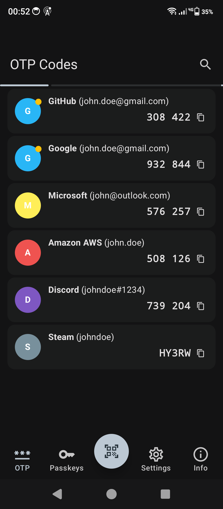
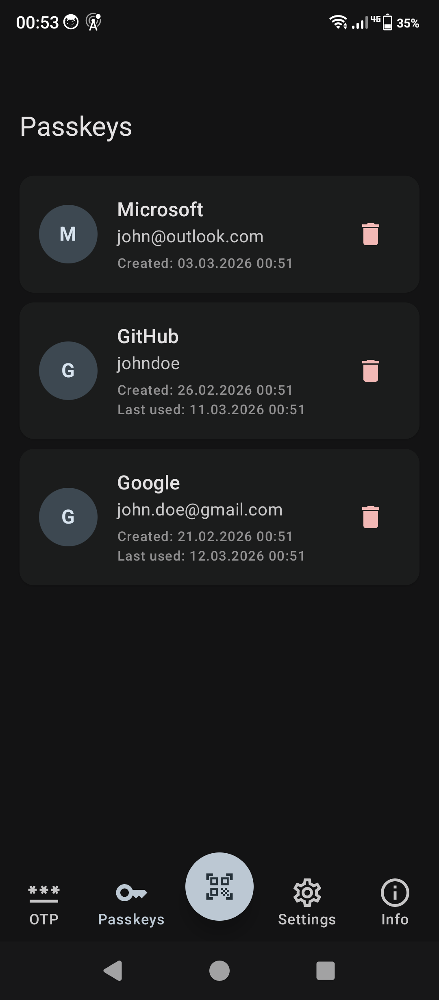
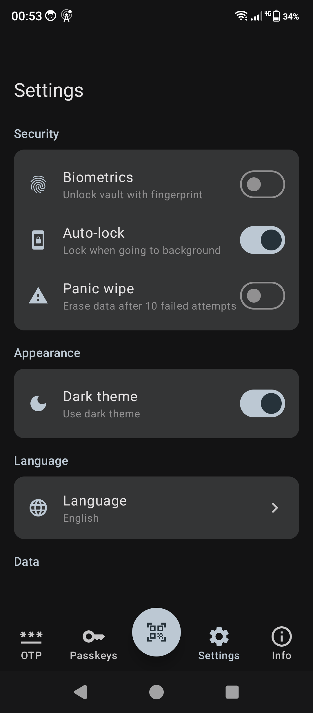

# RivikAuth

A modern, privacy-focused Android authenticator combining **OTP** and **FIDO2/Passkeys** in a single app — with an encrypted vault, no Google Play Services dependency, and caBLE v2 hybrid transport support.

## Features

### One-Time Passwords
- TOTP, HOTP, Steam Guard, Yandex, mOTP
- SHA-1, SHA-256, SHA-512 algorithms
- 6–8 digit codes with configurable period
- Favorites, search, grouped entries

### FIDO2 / Passkeys
- Android Credential Provider Service (API 34+)
- Create and authenticate with passkeys
- caBLE v2 hybrid transport — scan a QR code on a desktop browser and authenticate via Bluetooth
- Linked device sessions — pair once, reconnect without QR on subsequent authentications
- NFC security key — use phone as FIDO2 NFC authenticator via HCE
- CTAP2 protocol, self-attestation

### Security
- **Encrypted vault** — SQLCipher database with AES-256
- **Master key** protected by Argon2id key derivation (19.5 MB memory cost)
- **AES-256-GCM** for key wrapping with authenticated encryption
- Biometric unlock via Android Keystore
- `FLAG_SECURE` screen protection
- Certificate pinning, HTTPS-only network config
- ProGuard/R8 minification in release builds

### Import / Export
- **Import from:** Aegis, Google Authenticator, 2FAS, Bitwarden, andOTP
- **Export:** JSON format

### No Google Play Services Required
- QR scanning via CameraX + ZXing (no ML Kit)
- Credential Provider API without GMS dependency

## Screenshots

<p align="center">
  
  &nbsp;&nbsp;
  
  &nbsp;&nbsp;
  
</p>

## Architecture

```
app/                    → Main activity, navigation, theme
feature/
  ├── otp/              → OTP list, entry cards, code generation
  ├── fido/             → Passkey list, caBLE QR scanner
  ├── vault/            → Setup & unlock screens
  ├── scanner/          → QR code scanner (otpauth:// parser)
  ├── settings/         → Preferences, about screen
  └── import-export/    → Multi-format import/export
core/
  ├── model/            → Data models (OtpEntry, FidoCredential, EntryGroup)
  ├── crypto/           → AES-GCM, Argon2, OTP generation, biometric key management
  ├── database/         → Room + SQLCipher (encrypted vault.db)
  └── datastore/        → Preferences, vault slot storage
service/
  ├── credential/       → CredentialProviderService (FIDO2/WebAuthn)
  ├── ble/              → BLE HID, caBLE v2 advertiser, CTAP command handler
  └── nfc/              → NFC HCE service — FIDO2 NFC security key transport
lib/
  ├── webauthn/         → COSE keys, AuthenticatorData, CTAP HID framing
  ├── attestation/      → Packed & None attestation
  └── cable/            → caBLE v2 tunnel, Noise protocol, EID, session management
```

**Stack:** Kotlin · Jetpack Compose · Material 3 · Hilt · Room · SQLCipher · Coroutines · DataStore

## Building

**Requirements:** JDK 17, Android SDK 35

```bash
# Debug
./gradlew assembleDebug

# Release (requires keystore)
./gradlew assembleRelease
```

The release APK is output to `app/build/outputs/apk/release/rivikauth-release-v<version>.apk`.

## Testing

```bash
# Unit tests
./gradlew test

# Instrumented tests (requires device/emulator)
./gradlew connectedAndroidTest
```

Test coverage includes OTP generation (RFC 6238/4226 vectors), master key round-trip encryption, WebAuthn attestation, CTAP HID framing, and vault setup/unlock flows.

## License

[MIT](LICENSE)
